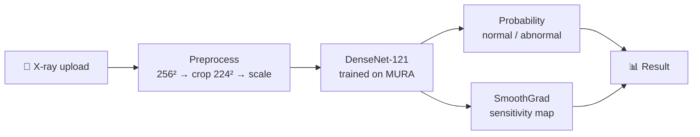

<div align="center">

# 🦴 X-Ray Vision

### Detection &amp; visualization of bone abnormalities in X-ray images using convolutional neural networks

Upload a bone X-ray → get the **probability it contains an abnormality**, plus a **sensitivity map** showing *where* the model is looking.

[](https://joystonmenezes.github.io/xray-vision/)

[](https://github.com/joystonmenezes/xray-vision/actions/workflows/ci.yml)
[](https://www.python.org/)
[](https://fastapi.tiangolo.com/)
[](https://pytorch.org/)
[](https://onnx.ai/)
[](LICENSE)


</div>

> [!WARNING]
> **Research &amp; demonstration only.** This is not a medical device, has not been clinically
> validated, and must never be used for real diagnosis.

---

## 📖 The story

This began as our **2021 final-year B.E. project** at NMAM Institute of Technology
(Visvesvaraya Technological University) — *“Detection and Visualization of Bone Abnormality
on X-Ray images using Convolutional Neural Networks”* by **Joyston Menezes** and
**Gagandeep Bekal** — built on Python 2, TensorFlow 1.x and Flask.

Five years later the code no longer ran on any modern machine. This repository is the
**2026 rebuild**: the *same trained model* and the *same functionality*, on a stack that
works today.

<div align="center">

| | 🕰️ 2021 original | ✨ This rebuild |
|:---|:---|:---|
| **Language** | Python 2.7 | Python 3.12 |
| **ML runtime** | TensorFlow 1.x frozen graph | PyTorch (same weights, via ONNX) |
| **Web framework** | Flask, server-rendered | FastAPI + JSON API + SPA |
| **Frontend** | Bootstrap 4 / jQuery template | Hand-rolled responsive HTML/CSS/JS |
| **Explainability** | SmoothGrad (TF gradients) | SmoothGrad (torch autograd) |
| **Quality** | manual setup | tests · Docker · CI · live demo |

</div>

## ⚙️ How it works



1. **Preprocess** — resized to 256×256 with aspect ratio preserved (padded square),
   center-cropped to 224×224, scaled to `[0, 1]` — identical to the training pipeline.
   ImageNet BGR mean subtraction happens inside the exported graph.
2. **Classify** — a **DenseNet-121** trained on the
   [Stanford MURA dataset](https://stanfordmlgroup.github.io/competitions/mura/)
   (~40k upper-extremity radiographs: elbow, finger, forearm, hand, humerus, shoulder,
   wrist) outputs `P(normal)` and `P(abnormal)`. The prediction is averaged over a few
   label-preserving **test-time views** (flip, small rotations, mild zoom) — the
   *“Test Time Multi-View”* stage from the original project — which steadies the answer
   when a study is captured at a slightly different angle.
3. **Explain** — [SmoothGrad](https://arxiv.org/abs/1706.03825) averages the input gradient
   of the abnormal-class logit across dozens of noise-perturbed copies of the image; the map
   is thresholded at its 99th percentile, blurred, and overlaid on the X-ray.

> [!NOTE]
> **The weights are the original 2021 weights.** The legacy TF1 frozen graph was converted
> once to ONNX ([`scripts/convert_model.py`](scripts/convert_model.py)) and is loaded as a
> native PyTorch module via [`onnx2torch`](https://github.com/ENOT-AutoDL/onnx2torch), which
> restores autograd — so explainability is computed exactly as it was originally, with no
> TensorFlow dependency.

## 🚀 Quickstart

```bash
git clone https://github.com/joystonmenezes/xray-vision.git
cd xray-vision

python -m venv .venv
source .venv/bin/activate        # Windows: .venv\Scripts\activate

pip install torch torchvision --index-url https://download.pytorch.org/whl/cpu
pip install -r requirements.txt

uvicorn app.main:app --port 8000
```

Open **<http://localhost:8000>**, drop in a bone X-ray, and results appear in a few seconds
on CPU.

<details>
<summary><b>🐳 Run with Docker</b></summary>

```bash
docker build -t xray-vision .
docker run -p 8000:8000 xray-vision
```

The image is self-contained (model included) and deploys anywhere Docker runs — Google
Cloud Run, Hugging Face Spaces, Render, Railway, Fly.io.
</details>

<details>
<summary><b>🔌 API reference</b></summary>

**`POST /api/analyze`** — multipart form with a `file` field (PNG/JPEG ≤ 16 MB)

```bash
curl -F "file=@docs/example_input.png" http://localhost:8000/api/analyze
```

```json
{
  "abnormal_probability": 99.6,
  "normal_probability": 0.4,
  "input_image": "data:image/png;base64,...",
  "heatmap": "data:image/png;base64,..."
}
```

**`GET /healthz`** — liveness probe.
</details>

<details>
<summary><b>🧪 Tests</b></summary>

```bash
pip install -r requirements-dev.txt
pytest
```

Covers preprocessing invariants, model output sanity (the bundled example is a known
abnormal study), SmoothGrad map properties, and the HTTP API. Runs on every push via
GitHub Actions.
</details>

<details>
<summary><b>🌐 About the in-browser demo</b></summary>

The [live demo](https://joystonmenezes.github.io/xray-vision/) is a static page on GitHub
Pages that runs the same ONNX model **entirely client-side** with
[onnxruntime-web](https://onnxruntime.ai/docs/tutorials/web/) (WebGPU, falling back to
WASM). No server, no cost, and uploaded X-rays never leave the visitor's device.

Because browser runtimes expose no gradients, the demo explains predictions with an
**occlusion sensitivity map** — sliding a patch across the image and measuring the drop in
the abnormal-class logit — rather than true SmoothGrad. Predictions are identical to the
server app; the heatmap is a coarser cousin.
</details>

## 🗂️ Repository layout

```
app/
├── main.py            FastAPI app (routes, validation)
├── inference.py       Model loading, prediction, SmoothGrad
├── preprocessing.py   Training-faithful image preprocessing
└── static/            Single-page frontend
model/
└── densenet121_mura.onnx    DenseNet-121, original 2021 weights
scripts/
├── convert_model.py   One-time TF1 frozen graph → ONNX conversion
└── benchmark_tta.py   Measures prediction stability (TTA vs single-view)
docs/web/demo.js       In-browser demo (onnxruntime-web)
index.html             GitHub Pages entry point
tests/                 pytest suite
```

## 📊 Results

Reported in the 2021 project, evaluated on MURA:

<div align="center">

| Study type | Accuracy |
|:---|:---:|
| Wrist | **87.86%** |
| Humerus | **87.15%** |
| Elbow | **86.45%** |
| Finger | **82.13%** |
| *Overall* — ResNet ≈ **86%** · DenseNet ≈ **85%** | |

</div>

## 🙏 Credits

- **Original project (2021)** — Joyston Menezes &amp; Gagandeep Bekal, Dept. of Computer
  Science &amp; Engineering, NMAM Institute of Technology, Nitte. Guided by
  Mr. Ramesha Shettigar.
- **Upstream implementation &amp; trained model** — adapted from
  [akaragou/xray-vision](https://github.com/akaragou/xray-vision) by Andreas Karagounis.
- **Dataset** — [MURA](https://stanfordmlgroup.github.io/competitions/mura/): Rajpurkar et al.,
  *MURA: Large Dataset for Abnormality Detection in Musculoskeletal Radiographs* (2017).
- **Explainability** — Smilkov et al.,
  *[SmoothGrad: removing noise by adding noise](https://arxiv.org/abs/1706.03825)* (2017).
- **Architectures** — Huang et al., *Densely Connected Convolutional Networks* (2017);
  He et al., *Deep Residual Learning for Image Recognition* (2015).

## 📄 License

[MIT](LICENSE) for the code in this repository. Model weights derive from the upstream
xray-vision project and are provided for research/educational use; MURA data is subject to
the Stanford ML Group's dataset terms.

<div align="center">

<sub>Built in 2021 · rebuilt in 2026 · <a href="https://joystonmenezes.github.io/xray-vision/">try it live</a></sub>

</div>
