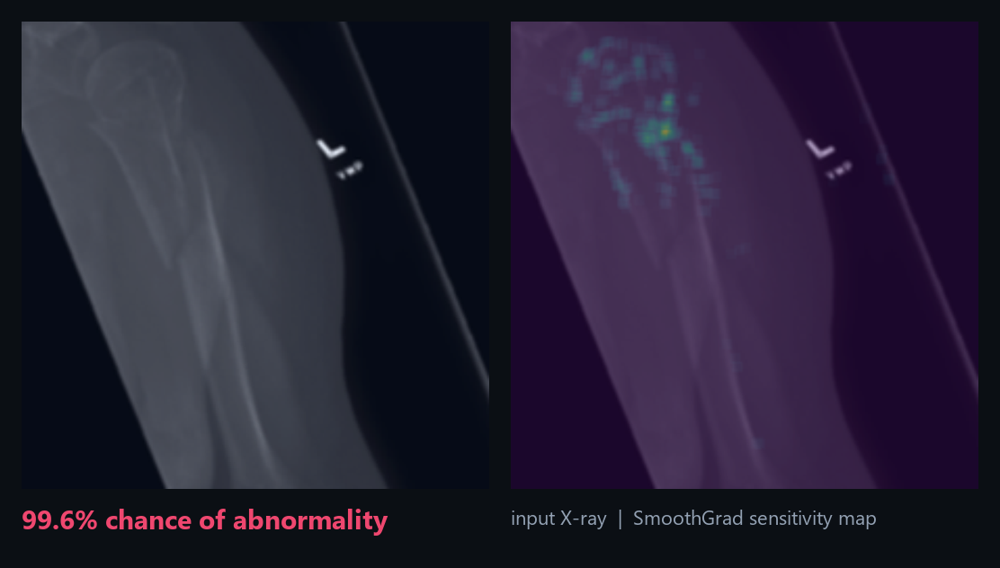

# 🦴 X-Ray Vision

**Detection and visualization of bone abnormalities in X-ray images using convolutional neural networks.**

Upload a bone X-ray → get the **probability that it contains an abnormality**, plus a
**SmoothGrad sensitivity map** highlighting the region that drove the prediction.

**▶ [Try it live](https://joystonmenezes.github.io/xray-vision/)** — an in-browser
version that runs the same model entirely on your device via onnxruntime-web
(WebGPU/WASM). No server, and your X-ray never leaves your browser. (The live demo
uses an occlusion-based heatmap; the full app below computes true SmoothGrad.)



> ⚠️ **Disclaimer:** research & demonstration only. This is not a medical device and must
> not be used for any real clinical diagnosis.

---

## The story

This started life as our 2021 final-year B.E. project at NMAM Institute of Technology
(Visvesvaraya Technological University): *“Detection and Visualization of Bone Abnormality
on X-Ray images using Convolutional Neural Networks”* by **Joyston Menezes** and
**Gagandeep Bekal**, built on Python 2, TensorFlow 1.x, and Flask.

This repository is the **2026 modernization** — same trained model, same functionality,
rebuilt on a current stack:

| | 2021 original | This rebuild |
|---|---|---|
| Language | Python 2.7 | Python 3.12 |
| ML runtime | TensorFlow 1.x frozen graph | PyTorch (weights converted via ONNX) |
| Web framework | Flask + server-rendered pages | FastAPI + JSON API + single-page UI |
| Frontend | Bootstrap 4 / jQuery template | Hand-rolled responsive HTML/CSS/JS, zero frameworks |
| Explainability | SmoothGrad (TF gradients) | SmoothGrad (torch autograd) — same algorithm |
| Packaging | manual setup | `requirements.txt` + Dockerfile + tests |

## How it works

1. **Preprocess** — the image is resized to 256×256 preserving aspect ratio (padded to
   square), center-cropped to 224×224 and scaled to `[0, 1]` — identical to the training
   pipeline. ImageNet BGR mean subtraction happens inside the exported graph.
2. **Classify** — a **DenseNet-121** trained on the
   [Stanford MURA dataset](https://stanfordmlgroup.github.io/competitions/mura/)
   (~40k upper-extremity radiographs: elbow, finger, forearm, hand, humerus, shoulder,
   wrist) outputs `P(normal)` / `P(abnormal)`.
3. **Explain** — [SmoothGrad](https://arxiv.org/abs/1706.03825) averages the input
   gradient of the abnormal-class logit over dozens of noise-perturbed copies of the
   image; the map is thresholded at its 99th percentile, blurred, and overlaid on the
   X-ray.

The trained weights are the *original 2021 weights*: the legacy TF1 frozen graph was
converted once to ONNX (`scripts/convert_model.py`) and is loaded as a native PyTorch
module with [`onnx2torch`](https://github.com/ENOT-AutoDL/onnx2torch), which restores
autograd support — so the explainability is computed exactly the way it was in the
original project, no TensorFlow required.

## Quickstart

```bash
git clone <this-repo>
cd xray-vision

python -m venv .venv
# Windows: .venv\Scripts\activate     macOS/Linux: source .venv/bin/activate

pip install torch torchvision --index-url https://download.pytorch.org/whl/cpu   # CPU-only torch
pip install -r requirements.txt

uvicorn app.main:app --port 8000
```

Open <http://localhost:8000>, drop in a bone X-ray (PNG/JPEG), and you'll get the
abnormality probability and sensitivity map in a few seconds on CPU.

### Docker

```bash
docker build -t xray-vision .
docker run -p 8000:8000 xray-vision
```

The container is self-contained (model included) and runs anywhere Docker does —
Hugging Face Spaces (Docker space), Google Cloud Run, Render, Railway, etc.

## API

`POST /api/analyze` — multipart form with a `file` field (PNG/JPEG ≤ 16 MB):

```bash
curl -F "file=@docs/example_input.png" http://localhost:8000/api/analyze
```

```json
{
  "abnormal_probability": 99.6,
  "normal_probability": 0.4,
  "input_image": "data:image/png;base64,...",
  "heatmap": "data:image/png;base64,..."
}
```

`GET /healthz` — liveness probe.

## Tests

```bash
pip install -r requirements-dev.txt
pytest
```

Covers preprocessing invariants, model output sanity (the bundled example study is a
known abnormal case), SmoothGrad map properties, and the HTTP API.

## Repository layout

```
app/
  main.py           FastAPI app (routes, validation)
  inference.py      Model loading, prediction, SmoothGrad
  preprocessing.py  Training-faithful image preprocessing
  static/           Single-page frontend (HTML/CSS/JS)
model/
  densenet121_mura.onnx   Converted DenseNet-121 (original 2021 weights)
scripts/
  convert_model.py  One-time TF1-frozen-graph → ONNX conversion
tests/              pytest suite
docs/               Example image & screenshots
```

## Results (from the original project)

Evaluated on MURA studies in the 2021 report: ResNet ≈ 86% and DenseNet ≈ 85% overall
accuracy, with per-study-type performance of 86.45% (elbow), 82.13% (finger), 87.15%
(humerus) and 87.86% (wrist).

## Credits

- **Original project (2021):** Joyston Menezes & Gagandeep Bekal, Dept. of CSE,
  NMAM Institute of Technology, Nitte — guided by Mr. Ramesha Shettigar.
- The 2021 implementation and trained model were adapted from
  [akaragou/xray-vision](https://github.com/akaragou/xray-vision) by Andreas Karagounis.
- Dataset: [MURA](https://stanfordmlgroup.github.io/competitions/mura/) — Rajpurkar et
  al., *MURA: Large Dataset for Abnormality Detection in Musculoskeletal Radiographs*
  (2017).
- Explainability: Smilkov et al., *SmoothGrad: removing noise by adding noise* (2017).

## License

[MIT](LICENSE) for the code in this repository. The model weights derive from the
original xray-vision project and are provided for research/educational use; MURA data
is subject to the Stanford ML Group's dataset terms.
